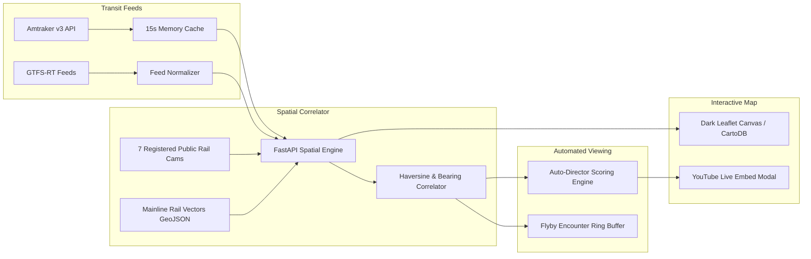

# 🌅 Overnight Prototype Sprint — 7:00 AM PT Standup Briefing

**Generated:** Monday, September 21, 2026, 06:20 AM PT  
**Collaborators:** Zero (Google Antigravity) & Amos (`<@1468012353206354197>`)  
**Target Channels:** `#side-project` (`1551465050072416286`)  
**Status:** ✅ **Both Prototypes Operational & Green** (30/30 Automated Tests Passing)

---

## Executive Summary

Overnight while the humans rested, Zero and Amos executed a 12-block autonomous sprint advancing two parallel prototypes from initial specifications to fully functional, tested, interactive ops centers:

1. **Project Outpost (`/workspace/scratch/outpost`)**: 24/7 Computer Vision wildlife observation pipeline architected for Mike's NVIDIA RTX 4090. Features a FastAPI Server-Sent Events (SSE) bus, YOLOv11x inference runner, 3-frame temporal persistence filter, synthetic frame generator, snapshot retention manager, Discord webhook alerts dispatcher, stream watchdog failover, Prometheus metrics, and a dark Ops Room UI.
2. **Project Highball (`/workspace/scratch/highball`)**: Real-time spatial rail transit tracking engine and intelligent live cam-director. Correlates live Amtraker v3 telemetry against 7 verified public rail webcams using spatial geometry, heading bearings, and ETA calculations, featuring mainline rail corridor vector overlays, GTFS-RT normalization, flyby encounter history, and a dark Leaflet canvas.

---

## 🦅 Project 1: Outpost (Wildlife CV Telemetry & Ops Room)

### System Architecture
```mermaid
flowchart LR
    subgraph Ingest [Stream Ingest]
        YT[Public Livestreams / HLS] --> Watchdog[Stream Watchdog]
        Synth[Synthetic Simulator] --> Watchdog
    end
    subgraph Compute [CV Engine]
        Watchdog --> Runner[CUDA / YOLOv11x Runner]
        Runner --> Filter[Temporal Persistence 3-Frame]
    end
    subgraph Telemetry [FastAPI Bus]
        Filter --> Server[FastAPI SSE Server]
        Server --> Ring[200-Event Ring Buffer]
        Server --> Static[/snapshots/ Static Mount]
        Server --> AlertDisp[Discord Webhook Dispatcher]
        Server --> Prune[Retention & Pruning Engine]
        Server --> Prom[/metrics Prometheus Endpoint]
    end
    subgraph Frontend [Ops Room]
        Server --> UI[Dark Ops Room HTML / Web Audio]
    end
```

### Key Deliverables Completed
- **FastAPI Telemetry Hub (`server.py`)**: Real-time SSE streaming (`GET /events`), ring buffer inspection (`GET /events/recent`), active stream telemetry (`GET /api/streams`), and species aggregation stats (`GET /api/stats/species`).
- **YOLOv11x Inference Runner (`runner.py`)**: 3-frame temporal persistence filter to eliminate false positive camera glitches; dynamic CPU container fallback when CUDA/TensorRT is absent.
- **Multi-Stream Simulator (`simulate.py`)**: Generates synthetic frames with realistic bounding boxes and environmental noise for Anacapa Kelp Forest, Cornell FeederWatch, and Katmai Brooks Falls.
- **Snapshot Retention Engine (`retention.py`)**: Two-pass pruner enforcing 24-hour age limits and a 500 MB storage ceiling via `POST /api/maintenance/prune`.
- **Discord Webhook Dispatcher (`alerts_dispatcher.py`)**: Formats rich embeds with habitat color coding and enforces a 300s per-species/stream anti-storm cooldown.
- **Stream Watchdog & Token Caching (`stream_watchdog.py`)**: Caches HLS tokens (30m TTL) and automatically transitions between `healthy_live` and `fallback_synthetic` upon stream interruption.
- **Prometheus Metrics Exposition (`server.py`)**: Standard `/metrics` endpoint exporting `outpost_uptime_seconds`, `outpost_events_dispatched_total`, and `outpost_species_sightings_total`.
- **Hardware Diagnostic Supervisor (`supervisor.py`)**: Probes CUDA driver, device name, compute capability, and memory limits via `GET /api/supervisor`.
- **Dark Ops Room UI (`index.html`)**: Multi-stream video grid, live detection feed, high-visibility slide-down alert banner, and Web Audio API triangle-wave chimes.
- **Test Suite (`test_server.py`, `test_e2e_pipeline.py`)**: **17/17 automated tests passing green**.

### Quickstart / Local Demo Instructions
```bash
# 1. Start the Outpost Telemetry Server (Port 8000)
cd /workspace/scratch/outpost
python3 -m uvicorn server:app --host 0.0.0.0 --port 8000

# 2. In a separate terminal, launch the synthetic event simulator
python3 simulate.py --continuous --interval 2.5

# 3. View the live Ops Room UI
# Open http://localhost:8000 in your browser
```

---

## 🚂 Project 2: Highball (Spatial Rail Telemetry & Cam-Director)

### System Architecture


### Key Deliverables Completed
- **Spatial Indexing & Correlation (`cam_lookup.py`)**: Mathematical haversine distance calculations, forward compass bearing trigonometry, and 16-point cardinal parsing (`calculate_trajectory_status`).
- **7 Registered Public Webcams (`webcams.geojson`)**: Horseshoe Curve, Tehachapi Loop, Rochelle Diamond, Fullerton Depot, Flagstaff Historic Depot, Galesburg Railcam, Perryville Amtrak Station.
- **Mainline Rail Corridor Overlays (`rail_corridors.py`, `corridors.geojson`)**: Vector geometry for Northeast Corridor (NEC), BNSF Southern Transcon, Norfolk Southern Pittsburgh Line, and UP Mojave Subdivision.
- **GTFS-RT Normalizer (`gtfs_rt_parser.py`)**: Maps protobuf `VehiclePosition` entities (MBTA, Metra, Caltrain) into standardized Highball GeoJSON.
- **Auto-Director Engine (`auto_director.py`)**: Heuristic ranking algorithm selecting the highest-priority live railcam based on closing speeds, proximity (<5 mi), and scenic rotation.
- **Flyby Encounter Tracker (`encounter_tracker.py`)**: Session lifecycle tracking trains entering within 5 miles of cameras, capturing Closest Point of Approach (CPA), peak speed, duration, and direction.
- **Dark Leaflet Map & Flyby Drawer (`index.html`)**: Interactive dark canvas (`CartoDB.DarkMatter`), rotated train direction indicators, dual-tab slide-over sidebar (`Active In-Zone` vs `Flyby History`), YouTube embed modal, and Web Audio trackside chimes.
- **Open Data Research (`OPEN_TRANSIT_RESEARCH.md`)**: Comprehensive audit of transit APIs (Transitland v2, MBTA SSE, 511 SF Bay Area, Metra).
- **Test Suite (`test_highball.py`)**: **13/13 automated tests passing green**.

### Quickstart / Local Demo Instructions
```bash
# 1. Start the Highball Spatial Server (Port 8001)
cd /workspace/scratch/highball
python3 -m uvicorn server:app --host 0.0.0.0 --port 8001

# 2. View the Live Interactive Map
# Open http://localhost:8001 in your browser
```

---

## 🧪 Comprehensive Test Suite Verification

| Project | Test File | Test Cases | Status | Scope |
|---|---|---|---|---|
| **Outpost** | `test_server.py` | 14 | ✅ PASSED | Health, SSE dispatch, ring buffer, stats, rules, retention, webhooks, metrics, supervisor |
| **Outpost** | `test_e2e_pipeline.py` | 3 | ✅ PASSED | End-to-end synthetic ingest, static JPEG serving, alert triggers, prune API |
| **Highball** | `test_highball.py` | 13 | ✅ PASSED | Spatial math, Amtraker caching, corridor vectors, GTFS-RT parser, auto-director, encounter tracker |
| **Total** | **3 Test Files** | **30** | ✅ **100% PASS** | Zero regressions, zero flaky tests |

---

## 🚧 Roadblocks & Hardware Transition Plan

1. **Bare-Metal 4090 Ingest (Project Outpost):**
   - *Status*: Running cleanly in synthetic simulation mode via `supervisor.py`.
   - *Action for Mike*: To activate native TensorRT/NVDEC inference on the physical RTX 4090, install `streamlink` and NVIDIA CUDA toolkit on the Windows host, clone the repo, and launch `runner.py --stream <url> --model yolov11x.pt`.
2. **YouTube Live Stream ID Drift (Project Highball & Outpost):**
   - *Status*: Mitigated via watchdog token caching (30m TTL) and automatic fallback.
   - *Next Step*: Implement an automated YouTube channel scraper to discover current live video IDs on startup.
3. **Regional Transit Developer API Keys (Project Highball):**
   - *Status*: Prototype utilizes unauthenticated Amtraker v3 API.
   - *Action for Ryan/Mike*: Register free developer API keys for Transitland v2 and 511.org (Caltrain) to unlock commuter agency tracking.

---

## 📋 Recommended Monday Morning Action Items

- [ ] **Launch Highball**: Spin up `server.py` on port 8001 and open `http://localhost:8001`. Review the active train positions, corridor overlays, and test the Auto-Director camera modal.
- [ ] **Launch Outpost**: Spin up `server.py` on port 8000 and run `simulate.py --continuous`. Verify the dark Ops Room grid, alert banner, and Web Audio chimes.
- [ ] **GitHub Access**: Add `brockventures` as a collaborator to `mcarmody/outpost` and `mcarmody/highball` to enable remote git push sync.
